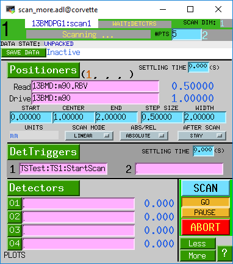

=================
Demonstation code
=================

scan_demo.py
------------

scan_demo.py is a simple program that demonstrates 
scanning an EPICS PV and collecting a complete tomography dataset at each point in the scan.  
The EPICS PV to be scanned could be anything, such as the sample height, sample temperature, etc.

.. literalinclude:: ../../demo/scan_demo.py

The following shows how the program is run, and the output.  In this case EPICS motor 13BMD:m90
was scanned from position 5.0, incrementing by 1.0, for 5 points:

>>> from scan_demo import scan_demo
>>> scan_demo('13BMDPG1:TS:', .01, '13BMD:m90', 5, 1, 5)
Completed dataset T:\tomo_user\2020\Run1\Test\Test_R_001.h5
Completed dataset T:\tomo_user\2020\Run1\Test\Test_R_002.h5
Completed dataset T:\tomo_user\2020\Run1\Test\Test_R_003.h5
Completed dataset T:\tomo_user\2020\Run1\Test\Test_R_004.h5
Completed dataset T:\tomo_user\2020\Run1\Test\Test_R_005.h5

Using the EPICS sscan record
-----------------------------

The same scan that was done in Python above can also be done using the EPICS sscan record.

The following is the medm screen for the sscan record during such a scan.  Motor 13BMD:m90
is being scanned, and TSTest:TS1:StartScan is the detector trigger.  The scan record thus
triggers a complete tomography scan at each point in the motor scan. 

Using the tomoscan-cli
----------------------

The same scan that was done in Python above can also be done using the tomoscan-cli::

    $ tomoscan single

tomoscan supports also vertical, horizontal and mosaic tomographic scans with::

    $ tomoscan vertical
    $ tomoscan horizontal
    $ tomoscan mosaic

to run a vertical scan::

    $ tomoscan vertical --vertical-start 0 --vertical-step-size 0.1 --vertical-steps 2

    2020-05-29 16:54:03,354 - vertical scan start
    2020-05-29 16:54:03,356 - vertical positions (mm): [0.  0.1]
    2020-05-29 16:54:03,358 - SampleInY stage start position: 0.000 mm
    2020-05-29 16:54:03,362 - single scan start
    2020-05-29 16:54:51,653 - single scan time: 0.805 minutes
    2020-05-29 16:54:51,654 - SampleInY stage start position: 0.100 mm
    2020-05-29 16:54:51,658 - single scan start
    2020-05-29 16:55:47,607 - single scan time: 0.932 minutes
    2020-05-29 16:55:47,607 - vertical scan time: 1.738 minutes
    2020-05-29 16:55:47,608 - vertical scan end

tomoscan-cli always stores the last used set of paramters so to repeat the above vertical scan::

    $ tomoscan vertical

use ``-h`` for the list of supported parameters.

To repeat the vertical scan 5 times with 60 s wait time between each::

    $ tomoscan vertical --sleep --sleep-steps 10 --sleep-time 60

to repeat the same::

    $ tomoscan vertical --sleep

while::

    $ tomoscan vertical

repeats a single vertical scan with --vertical-start 0 --vertical-step-size 0.1 --vertical-steps 5.

To reset the tomoscan-cli status::

	$ tomoscan init

after deleting the tomoscan.conf file if already exists.

