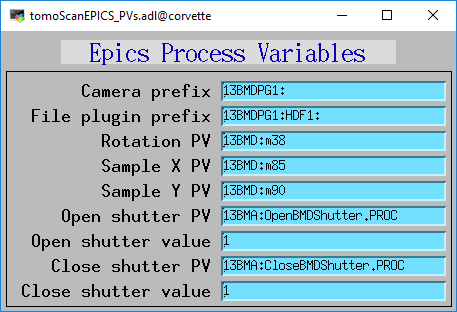
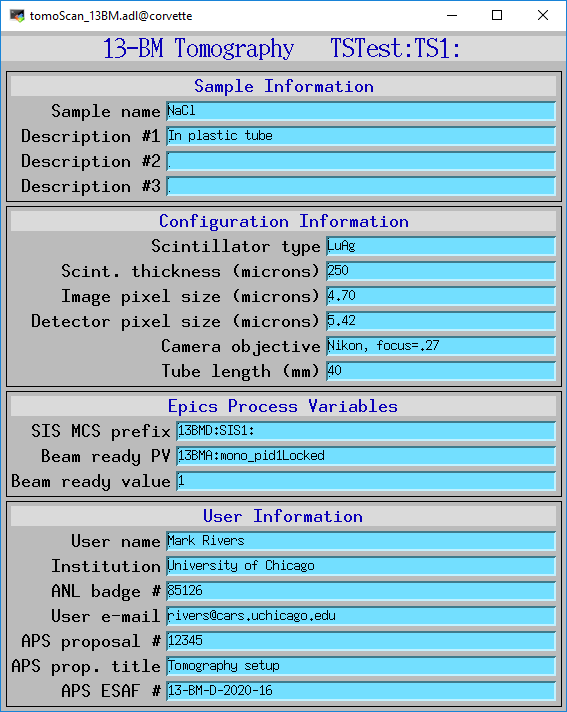

=============================
tomoScanApp EPICS application
=============================

tomoscan includes a complete example EPICS application, including:

- A database file that contains only the PVs required by the tomoscan.py base class
  :download:`tomoScan.template <../../tomoScanApp/Db/tomoScan.template>`
- A corresponding autosave request file
  :download:`tomoScan_settings.req <../../tomoScanApp/Db/tomoScan_settings.req>`.
- A database file that contains PVs used by the tomoscan_13bm derived class
  :download:`tomoScan_13BM.template <../../tomoScanApp/Db/tomoScan_13BM.template>`
- A corresponding autosave request file
  :download:`tomoScan_13BM_settings.req <../../tomoScanApp/Db/tomoScan_13BM_settings.req>`.
- OPI screens for medm, edm, caQtDM, CSS/Boy, and CSS/Phoebus
- An example IOC application that can be used to run the above databases.
  The databases are loaded in the IOC with the example substitutions file, 
  :download:`tomoScan.substitutions <../../iocBoot/iocTomoScan/tomoScan.substitutions>`.

The following tables list all of the records in the tomoScan.template file.
These records are used by the tomoscan base class and so are required.

tomoScan.template
-----------------

Camera and File Plugin PV Prefixes
~~~~~~~~~~~~~~~~~~~~~~~~~~~~~~~~~~

.. cssclass:: table-bordered table-striped table-hover
.. list-table::
  :header-rows: 1
  :widths: 30 10 60

  * - Record name
    - Record type
    - Description
  * - $(P)$(R)CameraPVPrefix
    - stringout
    - Contains the prefix for the camera, e.g. 13BMDPG1:
  * - $(P)$(R)FilePluginPVPrefix
    - stringout
    - Contains the prefix for the file plugin, e.g. 13BMDPG1:HDF1: or 13BMDPG1:netCDF1:

Shutter control
~~~~~~~~~~~~~~~

.. cssclass:: table-bordered table-striped table-hover
.. list-table::
  :header-rows: 1
  :widths: 30 10 60

  * - Record name
    - Record type
    - Description
  * - $(P)$(R)CloseShutterPVName
    - stringout
    - Contains the name of the PV to close the shutter
  * - $(P)$(R)CloseShutterValue
    - stringout
    - Contains the value to write to close the shutter
  * - $(P)$(R)OpenShutterPVName
    - stringout
    - Contains the name of the PV to open the shutter
  * - $(P)$(R)OpenShutterValue
    - stringout
    - Contains the value to write to open the shutter

Rotation, sample X and Y translation motors
~~~~~~~~~~~~~~~~~~~~~~~~~~~~~~~~~~~~~~~~~~~

.. cssclass:: table-bordered table-striped table-hover
.. list-table::
  :header-rows: 1
  :widths: 30 10 60

  * - Record name
    - Record type
    - Description
  * - $(P)$(R)RotationPVName
    - stringout
    - Contains the name of the rotation motor PV, e.g. 13BMD:m38
  * - $(P)$(R)SampleXPVName
    - stringout
    - Contains the name of the sample X translation PV, e.g. 13BMD:m85
  * - $(P)$(R)SampleYPVName
    - stringout
    - Contains the name of the sample Y translation PV, e.g. 13BMD:m90

Data collection control
~~~~~~~~~~~~~~~~~~~~~~~

.. cssclass:: table-bordered table-striped table-hover
.. list-table::
  :header-rows: 1
  :widths: 30 10 60

  * - Record name
    - Record type
    - Description
  * - $(P)$(R)RotationStart
    - ao
    - The starting rotation angle
  * - $(P)$(R)RotationStep
    - ao
    - The rotation step size
  * - $(P)$(R)RotationStop
    - calc
    - The final projection angle.  Computed as RotationStart + RotationStep*NumAngles.
      Provided as a convenience to check that the scan is correctly defined.
  * - $(P)$(R)NumAngles
    - ao
    - The number of angles (projections) to collect
  * - $(P)$(R)ReturnRotation
    - bo
    - Flag controlling whether to return rotation to RotationStart at the end of collection. Choices are 'No' and 'Yes'.

Dark field control
~~~~~~~~~~~~~~~~~~

.. cssclass:: table-bordered table-striped table-hover
.. list-table::
  :header-rows: 1
  :widths: 30 10 60

  * - Record name
    - Record type
    - Description
  * - $(P)$(R)NumDarkFields
    - longout
    - Number of dark fields to collect
  * - $(P)$(R)DarkFieldMode
    - mbbo
    - When to collect dark fields.  Choices are 'Start', 'End', 'Both', 'None'.
  * - $(P)$(R)DarkFieldValue
    - ao
    - A constant dark field value for every pixel, typically used when DarkFieldMode=None.

Flat field control
~~~~~~~~~~~~~~~~~~

.. cssclass:: table-bordered table-striped table-hover
.. list-table::
  :header-rows: 1
  :widths: 30 10 60

  * - Record name
    - Record type
    - Description
  * - $(P)$(R)NumFlatFields
    - longout
    - Number of flat fields to collect
  * - $(P)$(R)FlatFieldMode
    - mbbo
    - When to collect flat fields.  Choices are 'Start', 'End', 'Both', 'None'.
  * - $(P)$(R)FlatFieldAxis
    - mbbo
    - Axis to move when collecting flat fields.  Choices are 'X', 'Y', and 'Both'.
  * - $(P)$(R)FlatFieldValue
    - ao
    - A constant flat field value for every pixel, typically used when FlatFieldMode=None.
  * - $(P)$(R)SampleInX
    - ao
    - Position of the X stage when the sample is in position for collecting projections.
  * - $(P)$(R)SampleOutX
    - ao
    - Position of the X stage when the sample is out for collecting flat fields.
  * - $(P)$(R)SampleInY
    - ao
    - Position of the Y stage when the sample is in position for collecting projections.
  * - $(P)$(R)SampleOutY
    - ao
    - Position of the Y stage when the sample is out for collecting flat fields.

Exposure time
~~~~~~~~~~~~~

.. cssclass:: table-bordered table-striped table-hover
.. list-table::
  :header-rows: 1
  :widths: 30 10 60

  * - Record name
    - Record type
    - Description
  * - $(P)$(R)ExposureTime
    - ao
    - The exposure time in seconds.  Currently the same time is used for dark fields, flat fields, and projections.

File path and name control
~~~~~~~~~~~~~~~~~~~~~~~~~~

.. cssclass:: table-bordered table-striped table-hover
.. list-table::
  :header-rows: 1
  :widths: 30 10 60

  * - Record name
    - Record type
    - Description
  * - $(P)$(R)FilePath
    - waveform
    - The file path to save data.
  * - $(P)$(R)FileName
    - waveform
    - The file name to save data.
  * - $(P)$(R)FilePathExists
    - bi
    - Flag indicating whether the specified FilePath exists.
      This is a mirror of the FilePathExists_RBV record in the file plugin.

Scan control via Channel Access
~~~~~~~~~~~~~~~~~~~~~~~~~~~~~~~

.. cssclass:: table-bordered table-striped table-hover
.. list-table::
  :header-rows: 1
  :widths: 30 10 60

  * - Record name
    - Record type
    - Description
  * - $(P)$(R)MoveSampleIn
    - ao
    - Setting this record to 1 moves the sample in.
  * - $(P)$(R)MoveSampleOut
    - ao
    - Setting this record to 1 moves the sample out.
  * - $(P)$(R)StartScan
    - busy
    - Setting this record to 1 starts a scan.
  * - $(P)$(R)AbortScan
    - bo
    - Setting this record to 1 aborts a scan.

Scan status via Channel Access
~~~~~~~~~~~~~~~~~~~~~~~~~~~~~~

.. cssclass:: table-bordered table-striped table-hover
.. list-table::
  :header-rows: 1
  :widths: 30 10 60

  * - Record name
    - Record type
    - Description
  * - $(P)$(R)ScanStatus
    - waveform
    - This record will be updated with the scan status while scanning.
  * - $(P)$(R)ImagesCollected
    - stringout
    - This record will be updated with the current projection number while scanning.
  * - $(P)$(R)ImagesSaved
    - stringout
    - This record will be updated with the current projection number saved.
  * - $(P)$(R)ElapsedTime
    - stringout
    - This record will be updated with the elapsed time while scanning.
  * - $(P)$(R)RemainingTime
    - stringout
    - This record will be updated with the estimated time remaining while scanning.
  * - $(P)$(R)ServerRunning
    - bi
    - This record will be ``Running`` if the Python server is running and ``Stopped`` if not.
      It is controlled by a watchdog timer, and will change from ``Running`` to ``Stopped``
      within 5 seconds if the Python server exits.

tomoScan_settings.req
---------------------

This is the autosave request file for tomoScan.template. This file serves 2 purposes:

- It is used by autosave to determine which PVs to save in the ``auto_settings.sav`` file.

- It is read in the constructor of the TomoScan class to determine what PVs to read and write.

It contains 4 types of PVs:

1) Configuration PVs. These are PVs the control how tomography scans are collected, and provide metadata
   about the scan. An example is $(P)$(R)RotationStart.  These have the following properties:

  - They are saved by autosave in the auto_settings.sav file.
  - They are saved by TomoScan in configuration files. 
  - They do **not** contain the string "PVName" or "PVPrefix" in their PV names.
  - They appear as normal lines in the file, not in comment lines.

2) PVs that contain the name of another PV.  These are used to configure TomoScan to control a particular motor
   for the rotation axis, sample X axis, etc.  An example is $(P)$(R)RotationPVName.  
   These have the following properties:

  - They contain the string "PVName" in their PV names.
  - They are saved by autosave in the auto_settings.sav file.
  - They are **not** saved by TomoScan in configuration files. 
  - They appear as normal lines in the file, not in comment lines.

3) PVs that contain the PV prefix for a set of other PVs.  These are used to configure TomoScan to control a particular 
   areaDetector camera, etc.  Examples are (P)$(R)CameraPVPrefix and $(P)$(R)FilePluginPVPrefix.  
   These have the following properties:

  - They contain the string "PVPrefix" in their PV names.
  - They are saved by autosave in the auto_settings.sav file.
  - They are **not** saved by TomoScan in configuration files. 
  - They appear as normal lines in the file, not in comment lines.

4) PVs that are required by TomoScan, but which should not be saved and restored by autosave, either because
   they are read-only, or because writing to them when the IOC starts might have unwanted consequences.
   These have the following properties:

  - They appear in comment lines in the file.  The comment line must start with the string #controlPV followed by the PV name.
  - They do **not** contain the string "PVName" or "PVPrefix" in their PV names.
  - They are **not** saved by autosave in the auto_settings.sav file.
  - They are **not** saved by TomoScan in configuration files. 

When the request file is read it is used to construct all of the EPICS PV names that are used by TomoScan.
This allows TomoScan to avoid having any hard-coded PV names, and makes it easy to port to a new beamline.

tomoScan_13BM.template
----------------------

The following tables list all of the records in the tomoScan_13BM.template file.
This file is used for records needed by the tomoscan_13bm derived class, and also
for metadata PVs that should be saved in the tomoscan configuration file and files 
written by the areaDetector file plugins.

SIS MCS Prefix
~~~~~~~~~~~~~~

.. cssclass:: table-bordered table-striped table-hover
.. list-table::
  :header-rows: 1
  :widths: 30 10 60

  * - Record name
    - Record type
    - Description
  * - $(P)$(R)MCSPVPrefix
    - stringout
    - Contains the prefix for the SIS MCS, e.g. 13BMD:SIS1:

Energy information
~~~~~~~~~~~~~~~~~~

.. cssclass:: table-bordered table-striped table-hover
.. list-table::
  :header-rows: 1
  :widths: 30 10 60

  * - Record name
    - Record type
    - Description
  * - $(P)$(R)EnergyMode
    - mbbo
    - Contains the energy mode of the beamline, e.g. 'Mono', 'Pink', 'White'.

Beam status information
~~~~~~~~~~~~~~~~~~~~~~~

.. cssclass:: table-bordered table-striped table-hover
.. list-table::
  :header-rows: 1
  :widths: 30 10 60

  * - Record name
    - Record type
    - Description
  * - $(P)$(R)BeamReadyPVName
    - stringout
    - Contains the name of the PV that indicates if beam is ready, e.g. 13BMA:mono_pid1Locked
  * - $(P)$(R)BeamReadyValue
    - stringout
    - Contains the value of the beam ready PV when beam is ready.

Optics information
~~~~~~~~~~~~~~~~~~

.. cssclass:: table-bordered table-striped table-hover
.. list-table::
  :header-rows: 1
  :widths: 30 10 60

  * - Record name
    - Record type
    - Description
  * - $(P)$(R)ScintillatorType
    - stringout
    - Contains the type of scintillator being used.
  * - $(P)$(R)ScintillatorThickness
    - ao
    - Contains the thickness of the scintillator in microns.
  * - $(P)$(R)ImagePixelSize
    - ao
    - Contains the pixel size on the sample in microns (i.e. includes objective magnification)
  * - $(P)$(R)DetectorPixelSize
    - ao
    - Contains the pixel size of the detector.
  * - $(P)$(R)CameraObjective
    - stringout
    - Description of the camera objective
  * - $(P)$(R)CameraTubeLength
    - stringout
    - Description of the camera objective

Sample information
~~~~~~~~~~~~~~~~~~

.. cssclass:: table-bordered table-striped table-hover
.. list-table::
  :header-rows: 1
  :widths: 30 10 60

  * - Record name
    - Record type
    - Description
  * - $(P)$(R)SampleName
    - stringout
    - Name of the sample
  * - $(P)$(R)SampleDescription1
    - stringout
    - Description of the sample, part 1
  * - $(P)$(R)SampleDescription2
    - stringout
    - Description of the sample, part 2
  * - $(P)$(R)SampleDescription3
    - stringout
    - Description of the sample, part 3

User information
~~~~~~~~~~~~~~~~

.. cssclass:: table-bordered table-striped table-hover
.. list-table::
  :header-rows: 1
  :widths: 30 10 60

  * - Record name
    - Record type
    - Description
  * - $(P)$(R)UserName
    - stringout
    - User name
  * - $(P)$(R)UserInstitution
    - stringout
    - User institution
  * - $(P)$(R)UserBadge
    - stringout
    - User badge number
  * - $(P)$(R)UserEmail
    - stringout
    - User email address
  * - $(P)$(R)ProposalNumber
    - stringout
    - Proposal number
  * - $(P)$(R)ProposalTitle
    - stringout
    - Proposal title
  * - $(P)$(R)ESAFNumber
    - stringout
    - Experiment Safety Approval Form number

tomoScan_13BM_settings.req
--------------------------

This is the autosave request file for tomoScan_13BM.template. It has the same usage and type of content 
as tomoScan_settings.req described above, except that it contains the PVs for the derived class TomoScan13BM.

medm files
----------

tomoScan.adl
~~~~~~~~~~~~

The following is the MEDM screen :download:`tomoScan.adl <../../tomoScanApp/op/adl/tomoScan.adl>` during a scan. 
The status information is updating.

.. image:: img/tomoScan.png
    :width: 75%
    :align: center

tomoScanEPICS_PVs.adl
~~~~~~~~~~~~~~~~~~~~~

The following is the MEDM screen :download:`tomoScanEPICS_PVs.adl <../../tomoScanApp/op/adl/tomoScanEPICS_PVs.adl>`. 
If these PVs are changed tomoscan must be restarted.

tomoScan_13BM.adl
~~~~~~~~~~~~~~~~~~~~~~

The following is the MEDM screen :download:`tomoScan_13BM.adl <../../tomoScanApp/op/adl/tomoScan_13BM.adl>`.  
This screen contains the PVs for the TomoScan_13BM derived class.  If the MCSPrefix or BeamReadyPV are changed then tomoscan must be restarted.

