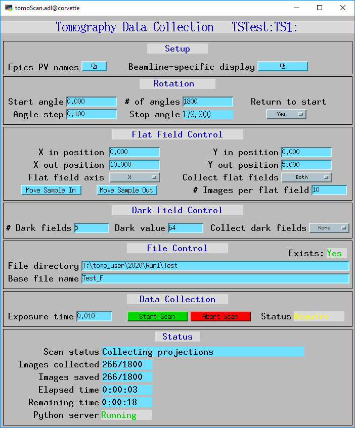
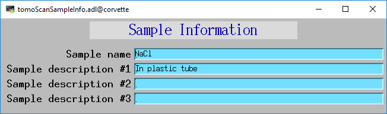
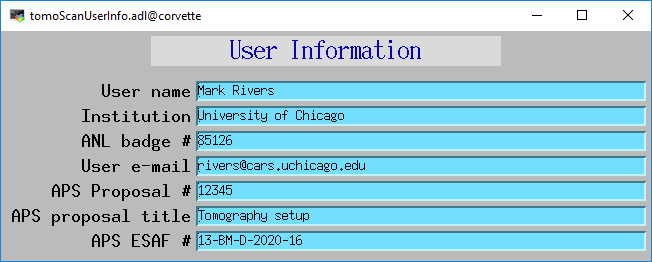
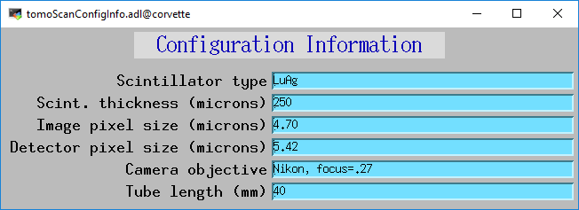

===========
Screenshots
===========

tomoScan.adl
============

The following is the MEDM screen tomoScan.adl during a scan. The status information is updating.

tomoScanEPICS_PVS.adl
=====================

The following is the MEDM screen tomoScanEPICS_PVS.adl. If these PVs are changed tomoscan must be restarted.

.. image:: img/tomoScanEPICS_PVS.png
    :width: 75%
    :align: center

tomoScanSampleInfo.adl
======================

The following is the MEDM screen tomoScanSampleInfo.adl.

tomoScanUserInfo.adl
====================

The following is the MEDM screen tomoScanUserinfo.adl.

tomoScanConfigInfo.adl
======================

The following is the MEDM screen tomoScanConfigInfo.adl.

