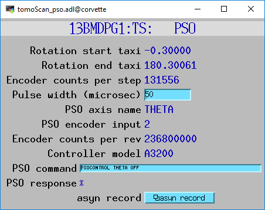
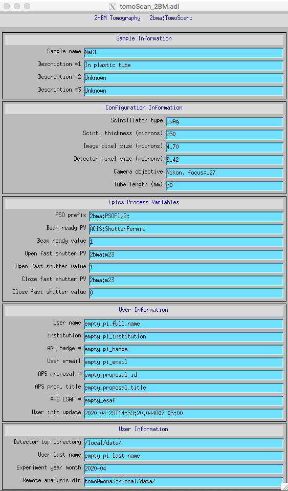
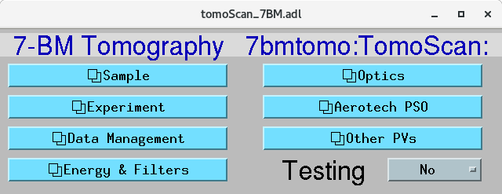

*****************************
tomoScanApp EPICS application
*****************************

.. 
   toctree::
   :hidden:

   tomoScan.template
   tomoScan_PSO.template
   tomoScan_13BM.template
   tomoScan_13BM_MCS.template
   tomoScan_13BM_PSO.template
   tomoScan_2BM.template
   tomoScan_settings.req
   tomoScan_PSO_settings.req
   tomoScan_13BM_MCS_settings.req
   tomoScan_13BM_PSO_settings.req
   tomoScan_2BM_settings.req
   tomoScan.substitutions

tomoscan includes a complete example EPICS application, including:

- A database file and corresponding autosave request file that contain the PVs required by the tomoscan.py base class.
- A database file and corresponding autosave request file that contain the PVs required by the tomoscan_pso.py intermediate base class.
- Database files and corresponding autosave request files that contain PVs used by the beamline-specific derived classes.
- OPI screens for medm, edm, caQtDM, CSS/Boy, and CSS/Phoebus
- An example IOC application that can be used to run the above databases.
  The databases are loaded in the IOC with the example substitutions file, 
  :doc:`tomoScan.substitutions`.

Base class files
================
The following tables list all of the records in the tomoScan.template file.
These records are used by the tomoscan base class and so are required.

tomoScan.template
-----------------

This is the database file that contains only the PVs required by the tomoscan.py base class
:doc:`tomoScan.template`.

Camera and File Plugin PV Prefixes
~~~~~~~~~~~~~~~~~~~~~~~~~~~~~~~~~~

.. cssclass:: table-bordered table-striped table-hover
.. list-table::
  :header-rows: 1
  :widths: 5 5 90

  * - Record name
    - Record type
    - Description
  * - $(P)$(R)CameraPVPrefix
    - stringout
    - Contains the prefix for the camera, e.g. 13BMDPG1:
  * - $(P)$(R)FilePluginPVPrefix
    - stringout
    - Contains the prefix for the file plugin, e.g. 13BMDPG1:HDF1: or 13BMDPG1:netCDF1:

Shutter control
~~~~~~~~~~~~~~~

.. cssclass:: table-bordered table-striped table-hover
.. list-table::
  :header-rows: 1
  :widths: 5 5 90

  * - Record name
    - Record type
    - Description
  * - $(P)$(R)CloseShutterPVName
    - stringout
    - Contains the name of the PV to close the shutter
  * - $(P)$(R)CloseShutterValue
    - stringout
    - Contains the value to write to close the shutter
  * - $(P)$(R)OpenShutterPVName
    - stringout
    - Contains the name of the PV to open the shutter
  * - $(P)$(R)OpenShutterValue
    - stringout
    - Contains the value to write to open the shutter

Rotation, sample X and Y translation motors
~~~~~~~~~~~~~~~~~~~~~~~~~~~~~~~~~~~~~~~~~~~

.. cssclass:: table-bordered table-striped table-hover
.. list-table::
  :header-rows: 1
  :widths: 5 5 90

  * - Record name
    - Record type
    - Description
  * - $(P)$(R)RotationPVName
    - stringout
    - Contains the name of the rotation motor PV, e.g. 13BMD:m38
  * - $(P)$(R)SampleXPVName
    - stringout
    - Contains the name of the sample X translation PV, e.g. 13BMD:m85
  * - $(P)$(R)SampleYPVName
    - stringout
    - Contains the name of the sample Y translation PV, e.g. 13BMD:m90

Data collection control
~~~~~~~~~~~~~~~~~~~~~~~

.. cssclass:: table-bordered table-striped table-hover
.. list-table::
  :header-rows: 1
  :widths: 5 5 90

  * - Record name
    - Record type
    - Description
  * - $(P)$(R)RotationStart
    - ao
    - The starting rotation angle
  * - $(P)$(R)RotationStep
    - ao
    - The rotation step size
  * - $(P)$(R)RotationStop
    - calc
    - The final projection angle.  Computed as RotationStart + RotationStep*NumAngles.
      Provided as a convenience to check that the scan is correctly defined.
  * - $(P)$(R)NumAngles
    - ao
    - The number of angles (projections) to collect
  * - $(P)$(R)ReturnRotation
    - bo
    - Flag controlling whether to return rotation to RotationStart at the end of collection. Choices are 'No' and 'Yes'. When 'Yes' the ScanStatus will report complete before the rotation axis returns to the start.

Dark field control
~~~~~~~~~~~~~~~~~~

.. cssclass:: table-bordered table-striped table-hover
.. list-table::
  :header-rows: 1
  :widths: 5 5 90

  * - Record name
    - Record type
    - Description
  * - $(P)$(R)NumDarkFields
    - longout
    - Number of dark fields to collect
  * - $(P)$(R)DarkFieldMode
    - mbbo
    - When to collect dark fields.  Choices are 'Start', 'End', 'Both', 'None'.
  * - $(P)$(R)DarkFieldValue
    - ao
    - A constant dark field value for every pixel, typically used when DarkFieldMode=None.

Flat field control
~~~~~~~~~~~~~~~~~~

.. cssclass:: table-bordered table-striped table-hover
.. list-table::
  :header-rows: 1
  :widths: 5 5 90

  * - Record name
    - Record type
    - Description
  * - $(P)$(R)NumFlatFields
    - longout
    - Number of flat fields to collect
  * - $(P)$(R)FlatFieldMode
    - mbbo
    - When to collect flat fields.  Choices are 'Start', 'End', 'Both', 'None'.
  * - $(P)$(R)FlatFieldAxis
    - mbbo
    - Axis to move when collecting flat fields.  Choices are 'X', 'Y', and 'Both'.
  * - $(P)$(R)FlatFieldValue
    - ao
    - A constant flat field value for every pixel, typically used when FlatFieldMode=None.
  * - $(P)$(R)SampleInX
    - ao
    - Position of the X stage when the sample is in position for collecting projections.
  * - $(P)$(R)SampleOutX
    - ao
    - Position of the X stage when the sample is out for collecting flat fields.
  * - $(P)$(R)SampleInY
    - ao
    - Position of the Y stage when the sample is in position for collecting projections.
  * - $(P)$(R)SampleOutY
    - ao
    - Position of the Y stage when the sample is out for collecting flat fields.

Frame type
~~~~~~~~~~

.. cssclass:: table-bordered table-striped table-hover
.. list-table::
  :header-rows: 1
  :widths: 5 5 90

  * - Record name
    - Record type
    - Description
  * - $(P)$(R)FrameType
    - mbbi
    - Type of the current frame. Choices are 'DarkField', 'FlatField', 'Projection'.
      This record can be used as a detector attribute to indicate what type of data 
      each frame contains.

Exposure time
~~~~~~~~~~~~~

.. cssclass:: table-bordered table-striped table-hover
.. list-table::
  :header-rows: 1
  :widths: 5 5 90

  * - Record name
    - Record type
    - Description
  * - $(P)$(R)ExposureTime
    - ao
    - The exposure time in seconds.  Currently the same time is used for dark fields and projections.
      The time for flat fields can be different, and is controlled by the following 2 records.
      Writing to this PV will copy the value to the camera AcquireTime PV.
  * - $(P)$(R)FlatExposureTime
    - ao
    - The exposure time for flat fields in seconds if the value of the $(P)$(R)DifferentFlatExposure
      record is "Different".  Otherwise $(P)$(R)ExposureTime is also used for flat fields.
  * - $(P)$(R)DifferentFlatExposure
    - bo
    - Controls whether $(P)$(R)ExposureTime or $(P)$(R)FlatExposureTime is used for the flat fields.
      Choices are "Same" (0) or "Different (1).

File path and name control
~~~~~~~~~~~~~~~~~~~~~~~~~~

.. cssclass:: table-bordered table-striped table-hover
.. list-table::
  :header-rows: 1
  :widths: 5 5 90

  * - Record name
    - Record type
    - Description
  * - $(P)$(R)FilePath
    - waveform
    - The file path to save data. Writing to this PV will copy the value to the file plugin.
  * - $(P)$(R)FileName
    - waveform
    - The file name to save data.  Writing to this PV will copy the value to the file plugin.
  * - $(P)$(R)FilePathExists
    - bi
    - Flag indicating whether the specified FilePath exists.
      This is a mirror of the FilePathExists_RBV record in the file plugin.
  * - $(P)$(R)OverwriteWarning
    - bi
    - Selects whether to open a dialog box to warn the user if the file to be written
      would overwrite an existing file.  The user can then choose 'Yes' or 'No'.

Location for data in HDF5 file
~~~~~~~~~~~~~~~~~~~~~~~~~~~~~~

.. cssclass:: table-bordered table-striped table-hover
.. list-table::
  :header-rows: 1
  :widths: 5 5 90

  * - Record name
    - Record type
    - Description
  * - $(P)$(R)HDF5ProjectionLocation
    - stringout
    - String defining the location in the HDF5 file to write projection frames.
      The default is ``/exchange/data``.
  * - $(P)$(R)HDF5DarkLocation
    - stringout
    - String defining the location in the HDF5 file to write dark field frames.
      The default is ``/exchange/data_dark``.
  * - $(P)$(R)HDF5FlatLocation
    - stringout
    - String defining the location in the HDF5 file to write flat field frames.
      The default is ``/exchange/data_white``.
  * - $(P)$(R)HDF5Location
    - stringout
    - String defining the location in the HDF5 file to write the current frame.
      This is updated by TomoScan depending on which type of frame is currently
      being collected.  This PV should be used to define the HDF5FrameLocation
      attribute in the detector attributes XML file.  The HDF5 layout XML file
      should use the HDF5FrameLocation attribute to control where the frame is
      written in the HDF5 file.

Scan control via Channel Access
~~~~~~~~~~~~~~~~~~~~~~~~~~~~~~~

.. cssclass:: table-bordered table-striped table-hover
.. list-table::
  :header-rows: 1
  :widths: 5 5 90

  * - Record name
    - Record type
    - Description
  * - $(P)$(R)MoveSampleIn
    - ao
    - Setting this record to 1 moves the sample in.
  * - $(P)$(R)MoveSampleOut
    - ao
    - Setting this record to 1 moves the sample out.
  * - $(P)$(R)StartScan
    - busy
    - Setting this record to 1 starts a scan.
  * - $(P)$(R)AbortScan
    - bo
    - Setting this record to 1 aborts a scan.

Scan status via Channel Access
~~~~~~~~~~~~~~~~~~~~~~~~~~~~~~

.. cssclass:: table-bordered table-striped table-hover
.. list-table::
  :header-rows: 1
  :widths: 5 5 90

  * - Record name
    - Record type
    - Description
  * - $(P)$(R)ScanStatus
    - waveform
    - This record will be updated with the scan status while scanning.
  * - $(P)$(R)ImagesCollected
    - stringout
    - This record will be updated with the current projection number while scanning.
  * - $(P)$(R)ImagesSaved
    - stringout
    - This record will be updated with the current projection number saved.
  * - $(P)$(R)ElapsedTime
    - stringout
    - This record will be updated with the elapsed time while scanning.
  * - $(P)$(R)RemainingTime
    - stringout
    - This record will be updated with the estimated time remaining while scanning.
  * - $(P)$(R)ServerRunning
    - bi
    - This record will be ``Running`` if the Python server is running and ``Stopped`` if not.
      It is controlled by a watchdog timer, and will change from ``Running`` to ``Stopped``
      within 5 seconds if the Python server exits.

tomoScan_settings.req
---------------------

This is the autosave request file for tomoScan.template
:doc:`tomoScan_settings.req`.

This file serves 2 purposes:

- It is used by autosave to determine which PVs to save in the ``auto_settings.sav`` file.

- It is read in the constructor of the TomoScan class to determine what PVs to read and write.

It contains 4 types of PVs:

1) Configuration PVs. These are PVs the control how tomography scans are collected, and provide metadata
   about the scan. An example is $(P)$(R)RotationStart.  These have the following properties:

  - They are saved by autosave in the auto_settings.sav file.
  - They are saved by TomoScan in configuration files. 
  - They do **not** contain the string "PVName" or "PVPrefix" in their PV names.
  - They appear as normal lines in the file, not in comment lines.

2) PVs that contain the name of another PV.  These are used to configure TomoScan to control a particular motor
   for the rotation axis, sample X axis, etc.  An example is $(P)$(R)RotationPVName.  
   These have the following properties:

  - They contain the string "PVName" in their PV names.
  - They are saved by autosave in the auto_settings.sav file.
  - They are **not** saved by TomoScan in configuration files. 
  - They appear as normal lines in the file, not in comment lines.

3) PVs that contain the PV prefix for a set of other PVs.  These are used to configure TomoScan to control a particular 
   areaDetector camera, etc.  Examples are (P)$(R)CameraPVPrefix and $(P)$(R)FilePluginPVPrefix.  
   These have the following properties:

  - They contain the string "PVPrefix" in their PV names.
  - They are saved by autosave in the auto_settings.sav file.
  - They are **not** saved by TomoScan in configuration files. 
  - They appear as normal lines in the file, not in comment lines.

4) PVs that are required by TomoScan, but which should not be saved and restored by autosave, either because
   they are read-only, or because writing to them when the IOC starts might have unwanted consequences.
   These have the following properties:

  - They appear in comment lines in the file.  The comment line must start with the string #controlPV followed by the PV name.
  - They do **not** contain the string "PVName" or "PVPrefix" in their PV names.
  - They are **not** saved by autosave in the auto_settings.sav file.
  - They are **not** saved by TomoScan in configuration files. 

When the request file is read it is used to construct all of the EPICS PV names that are used by TomoScan.
This allows TomoScan to avoid having any hard-coded PV names, and makes it easy to port to a new beamline.

Intermediate base class files
=============================
The following tables list all of the records in the tomoScan_PSO.template file.
This class is used when an Aerotech controller runs the rotation stage and
the PSO output is used to trigger the camera.

tomoScan_PSO.template
---------------------

This is the database file that contains only the PVs required by the tomoscan_pso.py base class.
These records cannot be modified at run-time, except for the asyn record.
Configuration records are set in the tomoScan.subsitutions file for each IOC, and set when the IOC starts.
Status records contain read-only status information.

:doc:`tomoScan.template`.

PSO configuration
~~~~~~~~~~~~~~~~~

.. cssclass:: table-bordered table-striped table-hover
.. list-table::
  :header-rows: 1
  :widths: 5 5 5 85

  * - Record name
    - Record type
    - Access type
    - Description
  * - $(P)$(R)PSOControllerModel
    - mbbi
    - Configuration
    - The Aerotech controller model being used. 
      This is needed because some PSO commands are controller dependent, and there appears
      to be no way to query the controller model.
      The choices are "Ensemble" (0), and "A3200" (1).
  * - $(P)$(R)PSOStartTaxi
    - ai
    - Status
    - The starting "taxi" position.  The taxi distance is used to allow the rotation stage
      to accelerate and reach the desired rotation speed before the first projection angle.
  * - $(P)$(R)PSOEndTaxi
    - ai
    - Status
    - The ending "taxi" position.  The taxi distance is used to allow the rotation stage
      to deccelerate to 0 after reaching the final projection angle.
  * - $(P)$(R)PSOEncoderCountsPerStep
    - longin
    - Status
    - The number of encoder counts between projections.
  * - $(P)$(R)PSOCommand
    - asyn
    - Write/read
    - This record is used to send PSO commands to the Aerotech controller.
      An EPICS drvAsynIPPort is created in the IOC startup script using the IP address of the
      Aerotech controller, and this record communicates using that asyn port.
      The record uses "Hybid" mode for both input and output, so that the strings can be
      longer than 40 characters.  This means that it uses the .BOUT field for output and
      the .BINP field for input.
      The .BOUT field is a text-input widget in the medm screen so the user can type commands
      directly to the controller for debugging.
  * - $(P)$(R)PSOAxisName
    - stringin
    - Configuration
    - The name of the rotation axis in the controller.  This is the name that is displayed
      in the Aerotech Motion Composer software.
  * - $(P)$(R)PSOCountsPerRotation
    - ai
    - Configuration
    - The number of encoder pulses per 360 degree rotation of the rotation stage.
      This is a signed number, and must be negative if the encoder direction and motor direction
      in the controller are different.
      On the A3200 this value is read from the controller in the constructor,
      and includes the correct sign.  This overrides the value in the subsitutions file.
      On the Ensemble this value must be provided in the substitutions file.
  * - $(P)$(R)PSOEncoderInput
    - longin
    - Configuration
    - Selects which encoder signal is used for the PSO control. This is hardware dependent,
      and is typically 2 or 3.
  * - $(P)$(R)PSOPulsWidth
    - ao
    - Write/read
    - Sets the PSO output pulse width in microseconds.  Different cameras may have different
      requirements for the trigger pulse width, so this value can be modified.
  * - $(P)$(R)PSOKeepAlive
    - asyn
    - Write/read
    - This record is needed on the Ensemble to keep the socket from timing out.
      It is not needed on the A3200, but does not hurt. 
      SCAN could be set to Passive on the A3200.

medm files
----------

tomoScan.adl
~~~~~~~~~~~~

The following is the MEDM screen :download:`tomoScan.adl <../../tomoScanApp/op/adl/tomoScan.adl>` during a scan. 
The status information is updating.

.. image:: img/tomoScan.png
    :width: 75%
    :align: center

tomoScanEPICS_PVs.adl
~~~~~~~~~~~~~~~~~~~~~

The following is the MEDM screen :download:`tomoScanEPICS_PVs.adl <../../tomoScanApp/op/adl/tomoScanEPICS_PVs.adl>`. 
If these PVs are changed tomoscan must be restarted.

.. image:: img/tomoScanEPICS_PVs.png
    :width: 75%
    :align: center

tomoScan_pso.adl
~~~~~~~~~~~~~~~~

The following is the MEDM screen :download:`tomoScan_pso.adl <../../tomoScanApp/op/adl/tomoScan_pso.adl>`. 
It contains the PVs that control the Aerotech PSO pulse control.

Beamline-specific files
=======================
The following files are for the beamline-specific derived classes.

Beamline 13BM
-------------

These are the files that are specific to the TomoScan13BM derived class used at APS beamline 13-BM-D.

tomoScan_13BM.template
~~~~~~~~~~~~~~~~~~~~~~

This is database file for the TomoScan13BM derived class
:doc:`tomoScan_13BM.template`.

The following tables list all of the records in the tomoScan_13BM.template file.
This file is used for records needed by the tomoscan_13bm derived class, and also
for metadata PVs that should be saved in the tomoscan configuration file and files 
written by the areaDetector file plugins.

SIS MCS Prefix
^^^^^^^^^^^^^^

.. cssclass:: table-bordered table-striped table-hover
.. list-table::
  :header-rows: 1
  :widths: 5 5 90

  * - Record name
    - Record type
    - Description
  * - $(P)$(R)MCSPVPrefix
    - stringout
    - Contains the prefix for the SIS MCS, e.g. 13BMD:SIS1:

Energy information
^^^^^^^^^^^^^^^^^^

.. cssclass:: table-bordered table-striped table-hover
.. list-table::
  :header-rows: 1
  :widths: 5 5 90

  * - Record name
    - Record type
    - Description
  * - $(P)$(R)EnergyMode
    - mbbo
    - Contains the energy mode of the beamline, e.g. 'Mono', 'Pink', 'White'.

Beam status information
^^^^^^^^^^^^^^^^^^^^^^^

.. cssclass:: table-bordered table-striped table-hover
.. list-table::
  :header-rows: 1
  :widths: 5 5 90

  * - Record name
    - Record type
    - Description
  * - $(P)$(R)BeamReadyPVName
    - stringout
    - Contains the name of the PV that indicates if beam is ready, e.g. 13BMA:mono_pid1Locked
  * - $(P)$(R)BeamReadyValue
    - stringout
    - Contains the value of the beam ready PV when beam is ready.

Optics information
^^^^^^^^^^^^^^^^^^

.. cssclass:: table-bordered table-striped table-hover
.. list-table::
  :header-rows: 1
  :widths: 5 5 90

  * - Record name
    - Record type
    - Description
  * - $(P)$(R)ScintillatorType
    - stringout
    - Contains the type of scintillator being used.
  * - $(P)$(R)ScintillatorThickness
    - ao
    - Contains the thickness of the scintillator in microns.
  * - $(P)$(R)ImagePixelSize
    - ao
    - Contains the pixel size on the sample in microns (i.e. includes objective magnification)
  * - $(P)$(R)DetectorPixelSize
    - ao
    - Contains the pixel size of the detector.
  * - $(P)$(R)CameraObjective
    - stringout
    - Description of the camera objective
  * - $(P)$(R)CameraTubeLength
    - stringout
    - Description of the camera objective

Sample information
^^^^^^^^^^^^^^^^^^

.. cssclass:: table-bordered table-striped table-hover
.. list-table::
  :header-rows: 1
  :widths: 5 5 90

  * - Record name
    - Record type
    - Description
  * - $(P)$(R)SampleName
    - stringout
    - Name of the sample
  * - $(P)$(R)SampleDescription1
    - stringout
    - Description of the sample, part 1
  * - $(P)$(R)SampleDescription2
    - stringout
    - Description of the sample, part 2
  * - $(P)$(R)SampleDescription3
    - stringout
    - Description of the sample, part 3

User information
^^^^^^^^^^^^^^^^

.. cssclass:: table-bordered table-striped table-hover
.. list-table::
  :header-rows: 1
  :widths: 5 5 90

  * - Record name
    - Record type
    - Description
  * - $(P)$(R)UserName
    - stringout
    - User name
  * - $(P)$(R)UserInstitution
    - stringout
    - User institution
  * - $(P)$(R)UserBadge
    - stringout
    - User badge number
  * - $(P)$(R)UserEmail
    - stringout
    - User email address
  * - $(P)$(R)ProposalNumber
    - stringout
    - Proposal number
  * - $(P)$(R)ProposalTitle
    - stringout
    - Proposal title
  * - $(P)$(R)ESAFNumber
    - stringout
    - Experiment Safety Approval Form number

tomoScan_13BM_settings.req
~~~~~~~~~~~~~~~~~~~~~~~~~~

This is the autosave request file for tomoScan_13BM.template
:doc:`tomoScan_13BM_settings.req`.

It has the same usage and type of content as tomoScan_settings.req described above, except that it
contains the PVs for the derived class TomoScan13BM.

medm files
~~~~~~~~~~

tomoScan_13BM.adl
^^^^^^^^^^^^^^^^^

The following is the MEDM screen :download:`tomoScan_13BM.adl <../../tomoScanApp/op/adl/tomoScan_13BM.adl>`.  
This screen contains the PVs for the TomoScan_13BM derived class.  If the MCSPrefix or BeamReadyPV are changed then tomoscan must be restarted.

.. image:: img/tomoScan_13BM.png
    :width: 75%
    :align: center

Beamline 2-BM
-------------

These are the files that are specific to the TomoScan2BM derived class used at APS beamline 2-BM-A.

tomoScan_2BM.template
~~~~~~~~~~~~~~~~~~~~~

This is database file for the TomoScan2BM derived class
:doc:`tomoScan_2BM.template`.

The following tables list all of the records in the tomoScan_2BM.template file.
This file is used for records needed by the tomoscan_2bm derived class, and also
for metadata PVs that should be saved in the tomoscan configuration file and files 
written by the areaDetector file plugins.

Pva, Roi and Cb Plugin PV Prefixes
^^^^^^^^^^^^^^^^^^^^^^^^^^^^^^^^^^

.. cssclass:: table-bordered table-striped table-hover
.. list-table::
  :header-rows: 1
  :widths: 5 5 90

  * - Record name
    - Record type
    - Description
  * - $(P)$(R)PvaPluginPVPrefix
    - stringout
    - Contains the prefix for the Pva plugin, e.g. 2bmbSP1:Pva1:
  * - $(P)$(R)RoiPluginPVPrefix
    - stringout
    - Contains the prefix for the ROI plugin, e.g. 2bmbSP1:ROI1:
  * - $(P)$(R)CbPluginPVPrefix
    - stringout
    - Contains the prefix for the CB plugin, e.g. 2bmbSP1:CB1:

Energy information
^^^^^^^^^^^^^^^^^^

.. cssclass:: table-bordered table-striped table-hover
.. list-table::
  :header-rows: 1
  :widths: 5 5 90

  * - Record name
    - Record type
    - Description
  * - $(P)$(R)Energy
    - mbbo
    - Contains the energy of the beamline.
  * - $(P)$(R)EnergyMode
    - mbbo
    - Contains the energy mode of the beamline, e.g. 'Mono', 'Pink', 'White'.
  * - $(P)$(R)Filters
    - stringout
    - Contains the material and thickness of the filters manually set in the beam path, e.g. Al 1mm; Glass 5mm.

Beam status information
^^^^^^^^^^^^^^^^^^^^^^^

.. cssclass:: table-bordered table-striped table-hover
.. list-table::
  :header-rows: 1
  :widths: 5 5 90

  * - Record name
    - Record type
    - Description
  * - $(P)$(R)BeamReadyPVName
    - stringout
    - Contains the name of the PV that indicates if beam is ready, e.g. ACIS:ShutterPermit
  * - $(P)$(R)BeamReadyValue
    - stringout
    - Contains the value of the beam ready PV when beam is ready.
  * - $(P)$(R)Testing
    - stringout
    - Enable testing mode 'Yes'.

Optics information
^^^^^^^^^^^^^^^^^^

.. cssclass:: table-bordered table-striped table-hover
.. list-table::
  :header-rows: 1
  :widths: 5 5 90

  * - Record name
    - Record type
    - Description
  * - $(P)$(R)ScintillatorType
    - stringout
    - Contains the type of scintillator being used.
  * - $(P)$(R)ScintillatorThickness
    - ao
    - Contains the thickness of the scintillator in microns.
  * - $(P)$(R)ImagePixelSize
    - ao
    - Contains the pixel size on the sample in microns (i.e. includes objective magnification)
  * - $(P)$(R)DetectorPixelSize
    - ao
    - Contains the pixel size of the detector.
  * - $(P)$(R)CameraObjective
    - stringout
    - Description of the camera objective
  * - $(P)$(R)CameraTubeLength
    - stringout
    - Description of the camera objective

Sample information
^^^^^^^^^^^^^^^^^^

.. cssclass:: table-bordered table-striped table-hover
.. list-table::
  :header-rows: 1
  :widths: 5 5 90

  * - Record name
    - Record type
    - Description
  * - $(P)$(R)SampleName
    - stringout
    - Name of the sample
  * - $(P)$(R)SampleDescription1
    - stringout
    - Description of the sample, part 1
  * - $(P)$(R)SampleDescription2
    - stringout
    - Description of the sample, part 2
  * - $(P)$(R)SampleDescription3
    - stringout
    - Description of the sample, part 3

User information
^^^^^^^^^^^^^^^^

.. cssclass:: table-bordered table-striped table-hover
.. list-table::
  :header-rows: 1
  :widths: 5 5 90

  * - Record name
    - Record type
    - Description
  * - $(P)$(R)UserName
    - stringout
    - User name
  * - $(P)$(R)UserInstitution
    - stringout
    - User institution
  * - $(P)$(R)UserBadge
    - stringout
    - User badge number
  * - $(P)$(R)UserEmail
    - stringout
    - User email address
  * - $(P)$(R)ProposalNumber
    - stringout
    - Proposal number
  * - $(P)$(R)ProposalTitle
    - stringout
    - Proposal title
  * - $(P)$(R)ESAFNumber
    - stringout
    - Experiment Safety Approval Form number
  * - $(P)$(R)UserInfoUpdate
    - stringout
    - Date and time of the last synchronization of the user information with the APS scheduling system

Data management information
^^^^^^^^^^^^^^^^^^^^^^^^^^^

.. cssclass:: table-bordered table-striped table-hover
.. list-table::
  :header-rows: 1
  :widths: 5 5 90

  * - Record name
    - Record type
    - Description
  * - $(P)$(R)DetectorTopDir
    - stringout
    - Top directory from where the raw data will be saved.
  * - $(P)$(R)UserLastName
    - stringout
    - User last name, automatically updated from the APS scheduling system, e.g. decarlo
  * - $(P)$(R)ExperimentYearMonth
    - stringout
    - Experiment year and month, automatically updated from the APS scheduling system, e.g. 2020-04
  * - $(P)$(R)RemoteAnalysisDir
    - stringout
    - Remote analysis location where to transfer the raw data for analysis, e.g tomo@handyn:/local/data/

Front-end shutter status
^^^^^^^^^^^^^^^^^^^^^^^^

.. cssclass:: table-bordered table-striped table-hover
.. list-table::
  :header-rows: 1
  :widths: 5 5 90

  * - Record name
    - Record type
    - Description
  * - $(P)$(R)ShutterStatusPVName
    - stringout
    - Contains the name of the PV to read the front-end shutter status

Fast shutter control
^^^^^^^^^^^^^^^^^^^^

.. cssclass:: table-bordered table-striped table-hover
.. list-table::
  :header-rows: 1
  :widths: 5 5 90

  * - Record name
    - Record type
    - Description
  * - $(P)$(R)CloseFastShutterPVName
    - stringout
    - Contains the name of the PV to close the fast shutter
  * - $(P)$(R)CloseFastShutterValue
    - stringout
    - Contains the value to write to close the fast shutter
  * - $(P)$(R)OpenFastShutterPVName
    - stringout
    - Contains the name of the PV to open the fast shutter
  * - $(P)$(R)OpenFastShutterValue
    - stringout
    - Contains the value to write to open the fast shutter

Stream control
^^^^^^^^^^^^^^

.. cssclass:: table-bordered table-striped table-hover
.. list-table::
  :header-rows: 1
  :widths: 5 5 90

  * - Record name
    - Record type
    - Description
  * - $(P)$(R)StreamCapture
    - busy
    - In streaming mode, set to "Capture" to start the projection saving
  * - $(P)$(R)StreamNumCapture
    - longout
    - In streaming mode, set the number of projections to save when capture is set
  * - $(P)$(R)StreamNumCaptured
    - longout
    - Number of imaged captured in streaming mode
  * - $(P)$(R)StreamNumTotalCaptured
    - longout
    - Total number of imaged captured in streaming mode
  * - $(P)$(R)StreamRetakeFlat
    - busy,
    - Stream retake flat. Choices are 'Done' and 'Capture'. When 'Capture' a new set of flat field images will be collected and used for reconstructing the following projections
  * - $(P)$(R)StreamRetakeDark
    - busy  
    - Stream retake dark. Choices are 'Done' and 'Capture'. When 'Capture' a new set of dark field images will be collected and used for reconstructing the following projections
  * - $(P)$(R)StreamPreCount
    - longout
    - Streaming pre-count are the number of projections pre-capture that are stored in a buffer. At the end of capturing these images are added to the data file
  * - $(P)$(R)StreamPreCounted
    - longout
    - Streaming pre-counted are the number of projections pre-capture that have been in a buffer. At the end of capturing these images are added to the data file
  * - $(P)$(R)StreamBinning
    - mbbo
    - In streaming mode, set the binnig scale for projections and streamed reconstruction. Captured data are always not binned and saved at full size
  * - $(P)$(R)StreamMessage 
    - waveform  
    - Stream status message
  * - $(P)$(R)StreamCBStatusMessage 
    - waveform 
    - Stream sircular buffer status message
  * - $(P)$(R)StreamFileName 
    - waveform
    - Stream file name
  * - $(P)$(R)PvaStreamPVPrefix
    - stringout
    - Contains the prefix for the PVA server broadcasting dark and flat images in streaming mode, e.g. 2bmb:TomoScan:Stream:

tomoScan_2BM_settings.req
~~~~~~~~~~~~~~~~~~~~~~~~~

This is the autosave request file for tomoScan_2BM.template
:doc:`tomoScan_2BM_settings.req`.

It has the same usage and type of content as tomoScan_settings.req described above, except that it
contains the PVs for the derived class TomoScan2BM.

medm files
~~~~~~~~~~

tomoScan_2BM.adl
^^^^^^^^^^^^^^^^

The following is the MEDM screen :download:`tomoScan_2BM.adl <../../tomoScanApp/op/adl/tomoScan_2BM.adl>`.  
This screen contains the PVs for the TomoScan_2BM derived class.  If the BeamReadyPV is changed then tomoscan must be restarted.

tomoScan_2BM_stream.adl
^^^^^^^^^^^^^^^^^^^^^^^

The following is the MEDM screen :download:`tomoScan_2BM_stream.adl <../../tomoScanApp/op/adl/tomoScan_2BM_stream.adl>`.  
This screen contains the additonal PVs used by the TomoScan_stream_2BM derived class.  

.. image:: img/tomoScan_2BM_stream.png
    :width: 75%
    :align: center

Beamline 7-BM
-------------

These are the files that are specific to the TomoScan7BM derived class used at APS beamline 7-BM.

tomoScan_7BM.template
~~~~~~~~~~~~~~~~~~~~~

This is database file for the TomoScan7BM derived class
:doc:`tomoScan_7BM.template`.

The following tables list all of the records in the tomoScan_7BM.template file.
This file is used for records needed by the tomoscan_7bm derived class, and also
for metadata PVs that should be saved in the tomoscan configuration file and files 
written by the areaDetector file plugins.

PSO Parameters
^^^^^^^^^^^^^^

.. cssclass:: table-bordered table-striped table-hover
.. list-table::
  :header-rows: 1
  :widths: 5 5 90

  * - Record name
    - Record type
    - Description
  * - $(P)$(R)startTaxi
    - ao
    - Start position with taxi
  * - $(P)$(R)endTaxi
    - ao
    - End position with taxi
  * - $(P)$(R)EncoderPulsesPerStep
    - longout
    - Encoder pulses per projection
  * - $(P)$(R)PSOAsynPVName
    - stringout
    - PSO asyn PV name
  * - $(P)$(R)PSOAxisName
    - stringout
    - PSO axis name
  * - $(P)$(R)PSOEncoderInput
    - longout
    - Encoder input
  * - (P)$(R)PSOPulsesPerRotation
    - ao
    - Number of encoder counts per revolution

Energy information
^^^^^^^^^^^^^^^^^^

.. cssclass:: table-bordered table-striped table-hover
.. list-table::
  :header-rows: 1
  :widths: 5 5 90

  * - Record name
    - Record type
    - Description
  * - $(P)$(R)Energy
    - mbbo
    - Contains the energy of the beamline.
  * - $(P)$(R)EnergyMode
    - mbbo
    - Contains the energy mode of the beamline, e.g. 'Mono', 'Pink', 'White'.
  * - $(P)$(R)Filters
    - stringout
    - Contains the material and thickness of the filters manually set in the beam path, e.g. Al 1mm; Glass 5mm.

Beam status information
^^^^^^^^^^^^^^^^^^^^^^^

.. cssclass:: table-bordered table-striped table-hover
.. list-table::
  :header-rows: 1
  :widths: 5 5 90

  * - Record name
    - Record type
    - Description
  * - $(P)$(R)BeamReadyPVName
    - stringout
    - Contains the name of the PV that indicates if beam is ready, e.g. ACIS:ShutterPermit
  * - $(P)$(R)BeamReadyValue
    - stringout
    - Contains the value of the beam ready PV when beam is ready.
  * - $(P)$(R)Testing
    - stringout
    - Enable testing mode 'Yes'.

Optics information
^^^^^^^^^^^^^^^^^^

.. cssclass:: table-bordered table-striped table-hover
.. list-table::
  :header-rows: 1
  :widths: 5 5 90

  * - Record name
    - Record type
    - Description
  * - $(P)$(R)ScintillatorType
    - stringout
    - Contains the type of scintillator being used.
  * - $(P)$(R)ScintillatorThickness
    - ao
    - Contains the thickness of the scintillator in microns.
  * - $(P)$(R)ImagePixelSize
    - ao
    - Contains the pixel size on the sample in microns (i.e. includes objective magnification)
  * - $(P)$(R)DetectorPixelSize
    - ao
    - Contains the pixel size of the detector.
  * - $(P)$(R)CameraObjective
    - stringout
    - Description of the camera objective
  * - $(P)$(R)CameraTubeLength
    - stringout
    - Description of the camera objective

Sample information
^^^^^^^^^^^^^^^^^^

.. cssclass:: table-bordered table-striped table-hover
.. list-table::
  :header-rows: 1
  :widths: 5 5 90

  * - Record name
    - Record type
    - Description
  * - $(P)$(R)SampleName
    - stringout
    - Name of the sample
  * - $(P)$(R)SampleDescription1
    - stringout
    - Description of the sample, part 1
  * - $(P)$(R)SampleDescription2
    - stringout
    - Description of the sample, part 2
  * - $(P)$(R)SampleDescription3
    - stringout
    - Description of the sample, part 3

User information
^^^^^^^^^^^^^^^^

.. cssclass:: table-bordered table-striped table-hover
.. list-table::
  :header-rows: 1
  :widths: 5 5 90

  * - Record name
    - Record type
    - Description
  * - $(P)$(R)UserName
    - stringout
    - User name
  * - $(P)$(R)UserInstitution
    - stringout
    - User institution
  * - $(P)$(R)UserBadge
    - stringout
    - User badge number
  * - $(P)$(R)UserEmail
    - stringout
    - User email address
  * - $(P)$(R)ProposalNumber
    - stringout
    - Proposal number
  * - $(P)$(R)ProposalTitle
    - stringout
    - Proposal title
  * - $(P)$(R)ESAFNumber
    - stringout
    - Experiment Safety Approval Form number
  * - $(P)$(R)UserInfoUpdate
    - stringout
    - Date and time of the last synchronization of the user information with the APS scheduling system

Data management information
^^^^^^^^^^^^^^^^^^^^^^^^^^^

.. cssclass:: table-bordered table-striped table-hover
.. list-table::
  :header-rows: 1
  :widths: 5 5 90

  * - Record name
    - Record type
    - Description
  * - $(P)$(R)DetectorTopDir
    - stringout
    - Top directory from where the raw data will be saved.
  * - $(P)$(R)UserLastName
    - stringout
    - User last name, automatically updated from the APS scheduling system, e.g. decarlo
  * - $(P)$(R)ExperimentYearMonth
    - stringout
    - Experiment year and month, automatically updated from the APS scheduling system, e.g. 2020-04
  * - $(P)$(R)RemoteAnalysisDir
    - stringout
    - Remote analysis location where to transfer the raw data for analysis, e.g tomo@handyn:/local/data/

Fast shutter control
^^^^^^^^^^^^^^^^^^^^

.. cssclass:: table-bordered table-striped table-hover
.. list-table::
  :header-rows: 1
  :widths: 5 5 90

  * - Record name
    - Record type
    - Description
  * - $(P)$(R)CloseFastShutterPVName
    - stringout
    - Contains the name of the PV to close the fast shutter
  * - $(P)$(R)CloseFastShutterValue
    - stringout
    - Contains the value to write to close the fast shutter
  * - $(P)$(R)OpenFastShutterPVName
    - stringout
    - Contains the name of the PV to open the fast shutter
  * - $(P)$(R)OpenFastShutterValue
    - stringout
    - Contains the value to write to open the fast shutter

tomoScan_7BM_settings.req
~~~~~~~~~~~~~~~~~~~~~~~~~

This is the autosave request file for tomoScan_7BM.template
:doc:`tomoScan_7BM_settings.req`.

It has the same usage and type of content as tomoScan_settings.req described above, except that it
contains the PVs for the derived class TomoScan7BM.

medm files
~~~~~~~~~~

tomoScan_7BM.adl
^^^^^^^^^^^^^^^^

The following is the MEDM screen :download:`tomoScan_7BM.adl <../../tomoScanApp/op/adl/tomoScan_7BM.adl>`.  
This screen contains the PVs for the TomoScan_7BM derived class.  If the BeamReadyPV is changed then tomoscan must be restarted.

