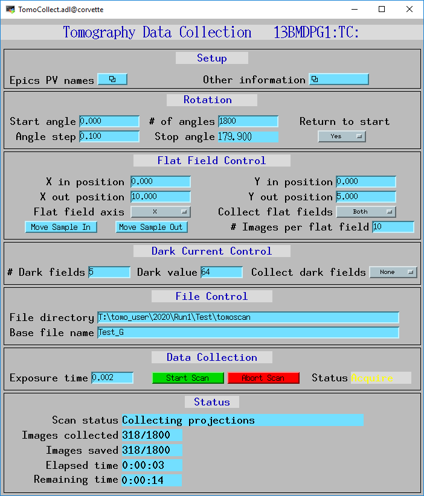
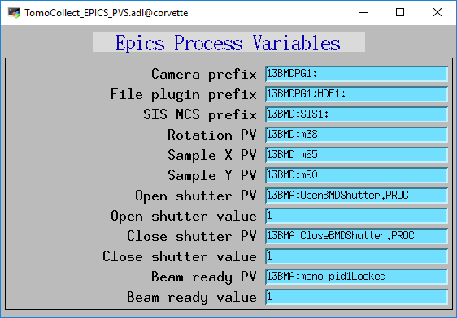
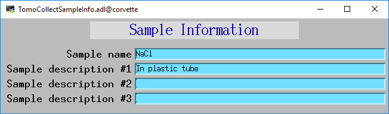
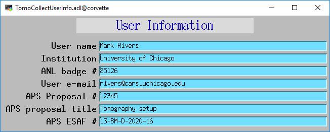
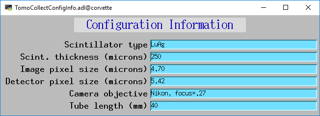

tomoscan
========

:author: Mark Rivers (University of Chicago)

.. _2bm-tomo: https://github.com/xray-imaging/2bm-tomo
.. _TomoCollect.template: https://github.com/tomography/tomoscan/blob/master/tomoscan/exampleFiles/13bm/TomoCollect.template
.. _TomoCollect_settings.req: https://github.com/tomography/tomoscan/blob/master/tomoscan/exampleFiles/13bm/TomoCollect_settings.req
.. _TomoCollect.substitutions: https://github.com/tomography/tomoscan/blob/master/tomoscan/exampleFiles/13bm/TomoCollect.substitutions

Table of Contents
-----------------

.. contents:: Contents

Introduction
------------

tomoscan is a Python class for collecting computed tomography data at the APS. 
tomoscan.py implements a base class with the code that should be beamline-independent.  
Beamline-dependent code is implemented in derived classes that inherit from tomoscan.

Advantages compared to current APS tomography Python software
-------------------------------------------------------------

The following describes some of the advantages of ``tomoscan`` compared to the existing 
APS tomography Python software (e.g. `2bm-tomo`_).

- tomoscan is object-oriented with a base class that implements things that
  can be beamline-independent, and derived classes to implement the beamline-specific
  code.

  - The existing software is procedural, rather than object-oriented.  This means that it
    must pass information to each function (e.g. ``global_PVs``, ``params``).
    More importantly it cannot take advantage of inheritance to allow overriding
    functions in a transparent manner.

- tomoscan does not contain any PV prefixes in the Python code.  It reads the prefixes
  from a configuration file, which makes porting to a new beamline very easy.
  The configuration file itself does not even need to be created, it is simply
  the existing EPICS autosave request file for the tomography database.

  - The existing software hard-codes the PV prefixes in the Python code. This
    requires many changes in the code when porting to a new beamline.

- tomoscan will implement a **server mode**.  tomoscan itself only implements the code
  to collect a single tomography dataset, including dark-fields, flat-fields, and projections.
  The server mode will listen for EPICS PVs that command tomoscan to collect a new dataset.
  There will be a status PV that indicates the scan status, indicating when the scan is complete.
  Thus, any EPICS client can be used to create complex scans, and this code does not need to be
  in the same Python process that is running tomoscan.  Possible clients include Python, IDL,
  the EPICS sscan record, SPEC, etc.  **NOTE: the server mode is a planned feature and does not
  currently exist.**

  - The existing software requires that scans be run from within the same Python process that is running
    the tomography scan.

- tomoscan is very compact code, less than 400 lines, including the base tomoscan class (274 lines) 
  and the derived class for 13-BM (124 lines).  
  This code collects a complete tomography dataset, including dark-fields, flat-fields, projections, 
  and saves a configuration file in JSON format at the end of the scan.
  The configuration file can be read back in to repeat the same scan at a future time.

  - The existing software is over 2,000 lines.  However, it does have more functionality than tomoscan
    currently has. 

Usage
-----
 
The following 3 Python commands are all that is required to collect a tomography dataset::

>>> from tomoscan_13bm import tomoscan_13bm

This line imports the code for class tomoscan_13bm.  tomoscan_13bm is a class that derives from tomoscan.  
It implements the logic used for scanning at 13-BM-D, but does not hard-code any EPICS PVs
for that specific beamline.  

Currently at 13-BM-D the rotation stage is a stepper motor driven by an OMS-58 motor controller.  
The step pulses from the motor controller are sent to an SIS3820 multi-channel scaler (MCS). 
The MCS is using in external trigger mode to divide the pulse frequency by N, 
where N is the number of stepper-motor pulses per rotation step.
The speed of the rotation motor is set such that the exposure and readout will have just completed
for image N when the trigger  for image N+1 arrives.
The MCS is also used to collect the dark-fields and the flat-fields, using its internal trigger mode and a
dwell time that is equal to the exposure time plus the readout time.

::

>>> ts = tomoscan_13bm("exampleFiles/13bm/TomoCollect_settings.req", {"$(P)":"13BMDPG1:", "$(R)":"TC:"})

This line creates the tomoscan_13bm object.  It takes two arguments that are passed to the 
tomoscan constructor:

- The first argument is the path to the TomoCollect_settings.req autosave request file for the 
  TomoCollect database described below.
- The second argument is a dictionary of macro substitution values for that database file.
  These define the PV prefixes to use when parsing that file.

When the TomoCollect_settings.req file is read it is used to construct all of the EPICS PV names that are used
by tomoscan.  This allows tomoscan to avoid having any hard-coded PV names, and makes it easy to port to a new beamline.

::

>>> ts.flyScan()

This line runs the tomoscan.flyScan() function.  The base class implementation of flyScan does the common operations
required for a tomography dataset:

- Calls the beginScan() method in the derived class.  This performs whatever operations are required before the scan.
- Closes the shutter and collects the dark fields by calling the collectDarkFields() method in the derived class. 
  This can be done before the scan, after the scan, both before and after, or never.
- Opens the shutter, moves the sample out, and collects the flat fields by calling the collectFlatFields() method in the derived class. 
  This can be done before the scan, after the scan, both before and after, or never.
- Moves the sample in and calls the collectProjections() method in the derived class.  
  This method waits for the data collection to complete.
- Calls the endScan() method in the derived class to do any post-scan operations required.
  These may include moving the rotation stage back to the start position, putting the camera in Continuous mode, etc.

Tomography data collection database
-----------------------------------

tomoscan includes an example `TomoCollect.template`_ file, and a corresponding `TomoCollect_settings.req`_ file.
The database is loaded in the IOC with the example `TomoCollect.substitutions`_ file.

The following tables lists all of the records in the TomoCollect.template file. The first table lists the records
that are required by tomoscan.  The second table lists the records that are using only by the tomoscan server mode.
The third table lists the records that are optional, and are not used by the tomoscan base class.

Required records
~~~~~~~~~~~~~~~~

The following records are used by the tomoscan base class and so are required.

.. cssclass:: table-bordered table-striped table-hover
.. list-table::
  :header-rows: 1
  :widths: 30 10 60

  * - Record name
    - Record type
    - Description
  * - $(P)$(R)CameraPVPrefix
    - stringout
    - Contains the prefix for the camera, e.g. 13BMDPG1:
  * - $(P)$(R)FilePluginPVPrefix
    - stringout
    - Contains the prefix for the file plugin, e.g. 13BMDPG1:HDF1: or 13BMDPG1:netCDF1:
  * - $(P)$(R)CloseShutterPVName
    - stringout
    - Contains the name of the PV to close the shutter
  * - $(P)$(R)CloseShutterValue
    - stringout
    - Contains the value to write to close the shutter
  * - $(P)$(R)OpenShutterPVName
    - stringout
    - Contains the name of the PV to open the shutter
  * - $(P)$(R)OpenShutterValue
    - stringout
    - Contains the value to write to open the shutter
  * - $(P)$(R)RotationPVName
    - stringout
    - Contains the name of the rotation motor PV, e.g. 13BMD:m38
  * - $(P)$(R)SampleXPVName
    - stringout
    - Contains the name of the sample X translation PV, e.g. 13BMD:m85
  * - $(P)$(R)SampleYPVName
    - stringout
    - Contains the name of the sample Y translation PV, e.g. 13BMD:m90
  * - $(P)$(R)RotationStart
    - ao
    - The starting rotation angle
  * - $(P)$(R)RotationStep
    - ao
    - The rotation step size
  * - $(P)$(R)NumAngles
    - ao
    - The number of angles (projections) to collect
  * - $(P)$(R)ReturnRotation
    - bo
    - Flag controlling whether to return rotation to RotationStart at the end of collection. Choices are 'No' and 'Yes'.
  * - $(P)$(R)NumDarkFields
    - longout
    - Number of dark fields to collect
  * - $(P)$(R)DarkFieldMode
    - mbbo
    - When to collect dark fields.  Choices are 'Start', 'End', 'Both', 'None'.
  * - $(P)$(R)NumFlatFields
    - longout
    - Number of flat fields to collect
  * - $(P)$(R)FlatFieldMode
    - mbbo
    - When to collect flat fields.  Choices are 'Start', 'End', 'Both', 'None'.
  * - $(P)$(R)FlatFieldAxis
    - mbbo
    - Axis to move when collecting flat fields.  Choices are 'X', 'Y', and 'Both'.
  * - $(P)$(R)SampleInX
    - ao
    - Position of the X stage when the sample is in position for collecting projections.
  * - $(P)$(R)SampleOutX
    - ao
    - Position of the X stage when the sample is out for collecting flat fields.
  * - $(P)$(R)SampleInY
    - ao
    - Position of the Y stage when the sample is in position for collecting projections.
  * - $(P)$(R)SampleOutY
    - ao
    - Position of the Y stage when the sample is out for collecting flat fields.
  * - $(P)$(R)ExposureTime
    - ao
    - The exposure time in seconds.  Currently the same time is used for dark fields, flat fields, and projections.
  * - $(P)$(R)FilePath
    - waveform
    - The file path to save data.
  * - $(P)$(R)FileName
    - waveform
    - The file name to save data.
  * - $(P)$(R)ScanStatus
    - waveform
    - This record will be updated with the scan status while scanning.
  * - $(P)$(R)ScanPoint
    - stringout
    - This record will be updated with the current projection number while scanning.
  * - $(P)$(R)ElapsedTime
    - stringout
    - This record will be updated with the elapsed time while scanning.
  * - $(P)$(R)RemainingTime
    - stringout
    - This record will be updated with the estimated time remaining while scanning.

Server mode records
~~~~~~~~~~~~~~~~~~~

These records are used by the server mode.  **NOTE: This is not yet implemented.**

.. cssclass:: table-bordered table-striped table-hover
.. list-table::
  :header-rows: 1
  :widths: 30 10 60

  * - Record name
    - Record type
    - Description
  * - $(P)$(R)MoveSampleIn
    - ao
    - Writing 1 to this record will move the sample in.
  * - $(P)$(R)MoveSampleOut
    - ao
    - Writing 1 to this record will move the sample out.
  * - $(P)$(R)ScanReady
    - bi
    - This record will be 1 when the server is ready to execute a scan.
  * - $(P)$(R)StartScan
    - busy
    - Writing 1 to this record will start a scan.
  * - $(P)$(R)AbortScan
    - bo
    - Writing 1 to this record will abort a scan.

Optional records
~~~~~~~~~~~~~~~~

The following records are not used by the tomoscan base class and so are optional.

.. cssclass:: table-bordered table-striped table-hover
.. list-table::
  :header-rows: 1
  :widths: 30 60 10

  * - Record name
    - Record type
    - Description
  * - $(P)$(R)MCSPVPrefix
    - stringout
    - Contains the prefix for the SIS MCS, e.g. 13BMD:SIS1:
  * - $(P)$(R)RotationStop
    - calc
    - The final projection angle.  Computed as RotationStart + RotationStep*NumAngles.
      Provided as a convenience to check that the scan is correctly defined.
  * - $(P)$(R)DarkFieldValue
    - ao
    - A constant dark field value for every pixel, typically used when DarkFieldMode=None.
  * - $(P)$(R)FlatFieldValue
    - ao
    - A constant flat field value for every pixel, typically used when FlatFieldMode=None.
  * - $(P)$(R)BeamReadyPVName
    - stringout
    - Contains the name of the PV that indicates if beam is ready, e.g. 13BMA:mono_pid1Locked
  * - $(P)$(R)BeamReadyValue
    - stringout
    - Contains the value of the beam ready PV when beam is ready.
  * - $(P)$(R)EnergyMode
    - mbbo
    - Contains the energy mode of the beamline, e.g. 'Mono', 'Pink', 'White'.
  * - $(P)$(R)ScintillatorType
    - stringout
    - Contains the type of scintillator being used.
  * - $(P)$(R)ScintillatorThickness
    - ao
    - Contains the thickness of the scintillator in microns.
  * - $(P)$(R)DetectorPixelSize
    - ao
    - Contains the pixel size of the detector.
  * - $(P)$(R)ImagePixelSize
    - ao
    - Contains the pixel size on the sample in microns (i.e. includes objective magnification)
  * - $(P)$(R)CameraObjective
    - stringout
    - Description of the camera objective
  * - $(P)$(R)CameraTubeLength
    - stringout
    - Description of the camera objective
  * - $(P)$(R)SampleName
    - stringout
    - Name of the sample
  * - $(P)$(R)SampleDescription1
    - stringout
    - Description of the sample, part 1
  * - $(P)$(R)SampleDescription2
    - stringout
    - Description of the sample, part 2
  * - $(P)$(R)SampleDescription3
    - stringout
    - Description of the sample, part 3
  * - $(P)$(R)UserName
    - stringout
    - User name
  * - $(P)$(R)UserInstitution
    - stringout
    - User institution
  * - $(P)$(R)UserBadge
    - stringout
    - User badge number
  * - $(P)$(R)UserEmail
    - stringout
    - User email address
  * - $(P)$(R)ProposalNumber
    - stringout
    - Proposal number
  * - $(P)$(R)ProposalTitle
    - stringout
    - Proposal title
  * - $(P)$(R)ESAFNumber
    - stringout
    - Experiment Safety Approval Form number

Screenshots
------------

TomoCollect.adl
~~~~~~~~~~~~~~~

The following is the MEDM screen TomoCollect.adl during a scan. The status information is updating.

TomoCollect_EPICS_PVS.adl
~~~~~~~~~~~~~~~~~~~~~~~~~

The following is the MEDM screen TomoCollect_EPICS_PVS.adl. If these PVs are changed tomoscan must be restarted.

TomoCollectSampleInfo.adl
~~~~~~~~~~~~~~~~~~~~~~~~~

The following is the MEDM screen TomoCollectSampleInfo.adl.

TomoCollectUserInfo.adl
~~~~~~~~~~~~~~~~~~~~~~~

The following is the MEDM screen TomoCollectUserInfo.adl.

TomoCollectConfigInfo.adl
~~~~~~~~~~~~~~~~~~~~~~~~~

The following is the MEDM screen TomoCollectConfigInfo.adl.

